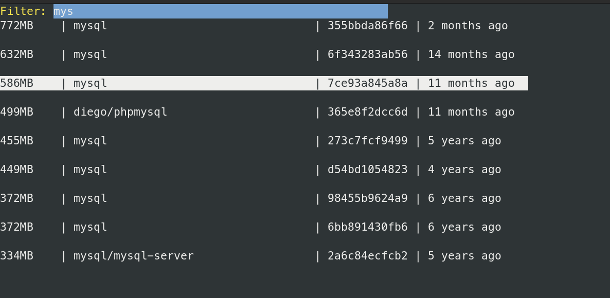
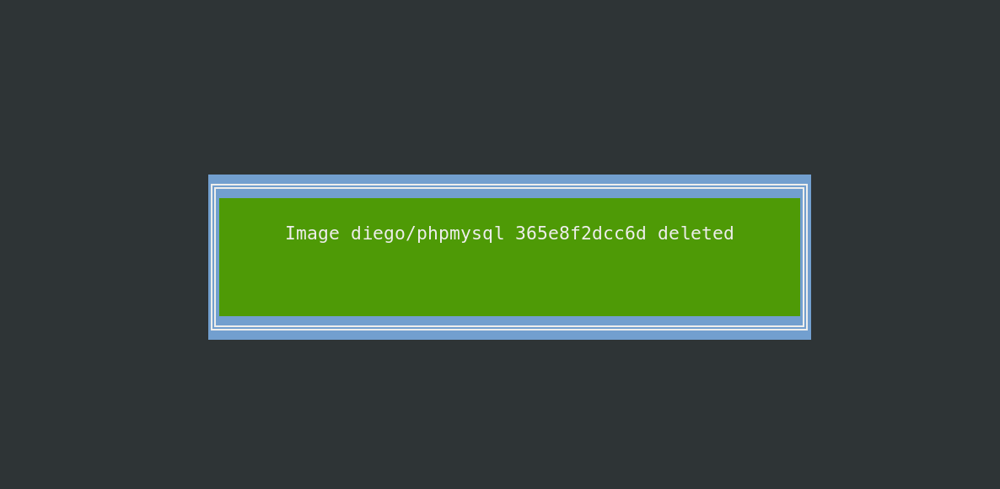

# Docker Clean Up

Simple Go CLI tool to clean up Docker images by searching for images and deleting them interactively.

### Run

```bash
./run.sh
```

### Result

Docker Clean Up: Search for image(press enter to delete) <br/>


Delete image: <br/>


### Fun Fact

Running on my machine, was able to save `53GB` of disk space by deleting unused Docker images.