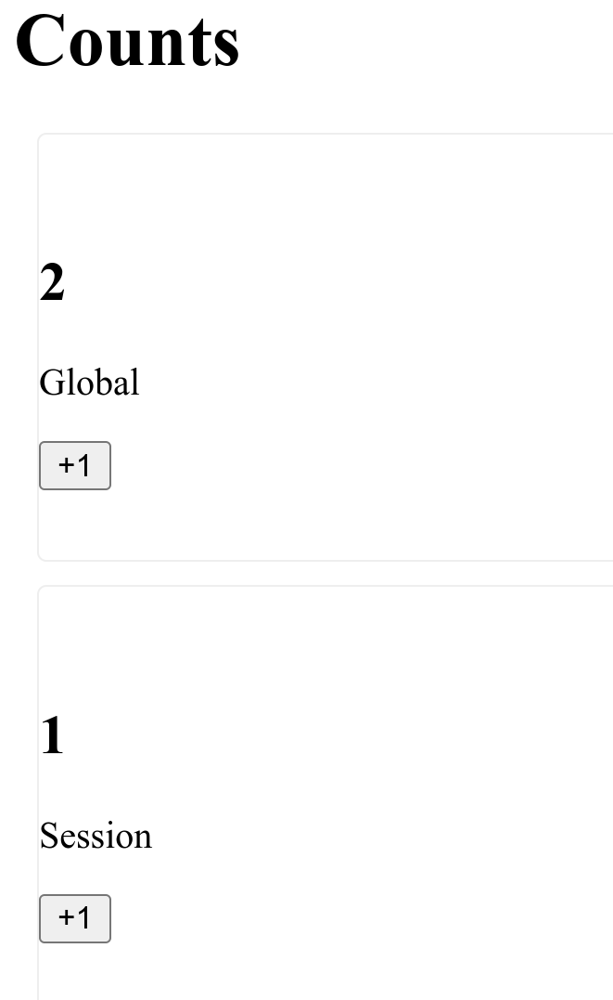

# HTMX in Go with Templ

## documentation

following htmx sample from here
(<https://github.com/a-h/templ/tree/main/examples/counter>)

## Notes

* I simplify the implementation
* Removed dynamod DB from AWS
* Added a in-memory implementation in Go with a hashmap

### Diego Tradeoffs analysis

## PROS

* Lightling Fast
* Relatively Simple
* Leverages the backend

## Cons

* Templ code generation, everytime changes .templ file need to re-generate ```templ generate```
* There is temporal coupling with the "js framework" with allow you to not "write as much js"
* There is a risk of building a distributed monolith

## App running
```bash
./run.sh
```
